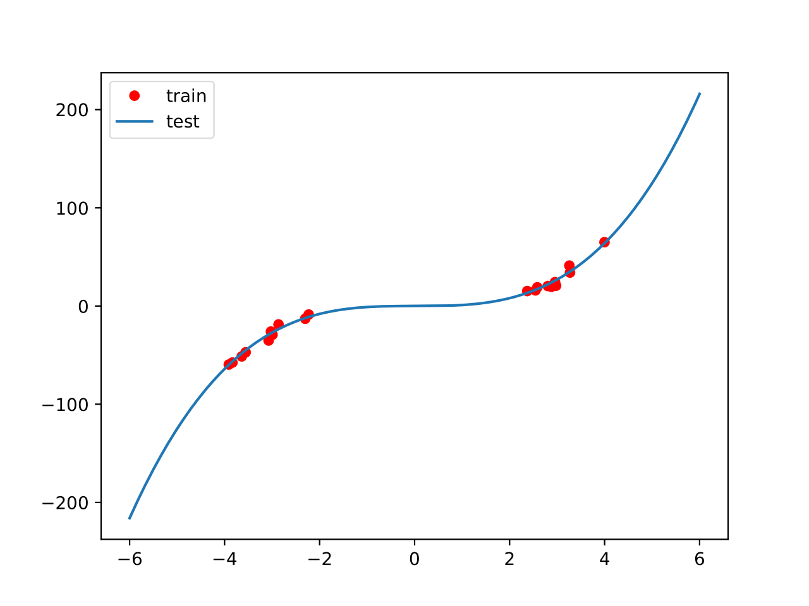
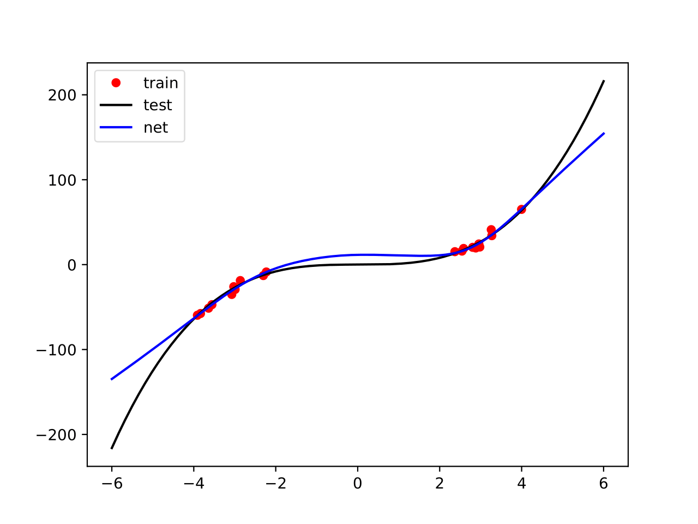

_LinearSampling_: A Framework for Sampling from GLMs for DNNs
---
While neural networks have incredible predictive power, they lack a measure of their uncertainty. We require uncertainty so that we can answer the question: *when can we trust the output of a neural network?* 

Recent methods have focused on forming Generalized Linear Models (GLMs) from a neural network, through linearization [1, 2]. Taking the first-order Taylor expansion of a deep neural network (DNN) around _all_ its parameters, and placing a prior over the new parameters, results in a DNN-GLM. Taking the first-order Taylor expansion parameters in the _final connected layer_ of the DNN results in an LL-GLM.

This package allows for lightweight, scalable sampling from the predictive posterior distribution of these GLMs. It is built to work with a ```Pytorch``` framework. 


### Installation
---
To install this package:
```
pip install git+https://github.com/josephwilsonmaths/LinearSampling.git
```

### Regression
---
We provide a simple example for how to use _LinearSampling_. First load a toy dataset:
```
import torch
import matplotlib.pyplot as plt
import numpy as np
from torch.utils.data import DataLoader, Dataset
from regressionutil import mlp,train,plot_bayes_method,toy_dataset

train_x,train_y,test_x,test_y = toy_dataset(n_train=20, n_test=10000, std=3)

## plot train
plt.plot(train_x,train_y,'ro',markersize=5,label='train')
plt.plot(test_x,test_y,label='test')
plt.legend()
plt.show()

```

<p align='center'>
  
</p>


A single-layer MLP is then trained on the data:

```
class toy_dataset(Dataset):
    def __init__(self,x,y):
        self.x = x
        self.y = y

    def __len__(self):
        return self.x.shape[0]

    def __getitem__(self, i):
        return self.x[i], self.y[i]
    
toy_train_loader = DataLoader(toy_dataset(train_x,train_y),n_train)
toy_test_loader = DataLoader(toy_dataset(test_x,test_y),n_test)

## Set up neural network.
map_net = mlp(width=50)

map_epochs = 10000; map_lr = 0.001
mse_loss = torch.nn.MSELoss()
optimizer_MSE = torch.optim.Adam(map_net.parameters(), lr = map_lr, weight_decay=0)
scheduler_MSE = torch.optim.lr_scheduler.PolynomialLR(optimizer_MSE, map_epochs, 0.5)

for t in range(map_epochs):
    train_loss = train(train_x, train_y, map_net, mse_loss, optimizer_MSE, scheduler_MSE)

## plot train
plt.plot(train_x,train_y,'ro',markersize=5,label='train')
plt.plot(test_x,test_y,'k',label='test')
plt.plot(test_x, map_net(test_x).detach(), 'b', label='net')
plt.legend()
plt.show()
plt.savefig('plotfitted.pdf',format='pdf')
```

<p align='center'>
  
</p>

We can now employ _LinearSampling_ to obtain an estimate of the epistemic (model) uncertainty of the DNN prediction. We first form predictions from the DNN-GLM:
```
import LinearSampling.Posteriors as lsp

train_data = toy_dataset(train_x,train_y)
test_data = toy_dataset(test_x,test_y)

dnn_glm = lsp.Posterior(network=map_net, 
                        glm_type='DNN',
                        task='regression', 
                        precision = 'double')

res = dnn_glm.train(train=train_data, 
                    bs=NUM_TRAIN_POINTS,
                    gamma = 1,
                    S = 10,
                    epochs=5000,
                    lr=1e-3,
                    mu=0.9,
                    verbose=True,
                    plot_loss_dir=None)

dnn_glm.scale_cal = 10
dnn_mu, dnn_var = dnn_glm.UncertaintyPrediction(test=test_data, bs=50, network_mean=False)
```

We can also form estimates from the more efficient LL-GLM:
```
ll_glm = LinearSampling.Posteriors.Posterior(network=map_net, 
                                              glm_type='LL',
                                              task='regression', 
                                              precision = 'double')

res = ll_glm.train(train=train_data, 
                    bs=NUM_TRAIN_POINTS,
                    gamma = 1,
                    S = 10,
                    epochs=5000,
                    lr=1e-3,
                    mu=0.9,
                    verbose=True,
                    plot_loss_dir='testing')

ll_glm.scale_cal = 100
ll_mu, ll_var = ll_glm.UncertaintyPrediction(test=test_data, bs=50, network_mean=False)
```

The NUQLS variance term can then be used to create confidence intervals around the prediction:
```
fs, ms, lw = 23, 5, 1.5

f, ((ax1, ax2)) = plt.subplots(1,2)

f.set_figheight(4)
f.set_figwidth(16)
f.subplots_adjust(hspace=0.5)

# Plot DNN-GLM
plot_bayes_method(ax1,dnn_mu,dnn_var,'DNN-GLM',fs=fs, ms=ms, lw=lw)

# Plot LL-GLM
plot_bayes_method(ax2,ll_mu,ll_var,'LL-GLM',fs=fs, ms=ms, lw=lw, legend_true=True)

plt.show()
```

<p align='center'>
  
</p>

### Classification (TODO)


References:

[1] "Improving predictions of Bayesian neural nets via local linearization", Immer et. al. 2021

[2] "Empirical Uncertainty Quantification with the Empirical Neural Tangent Kernel", Wilson et. al. 2025 

License
-------

This is free and unencumbered software released into the public domain.

Anyone is free to copy, modify, publish, use, compile, sell, or
distribute this software, either in source code form or as a compiled
binary, for any purpose, commercial or non-commercial, and by any means.
